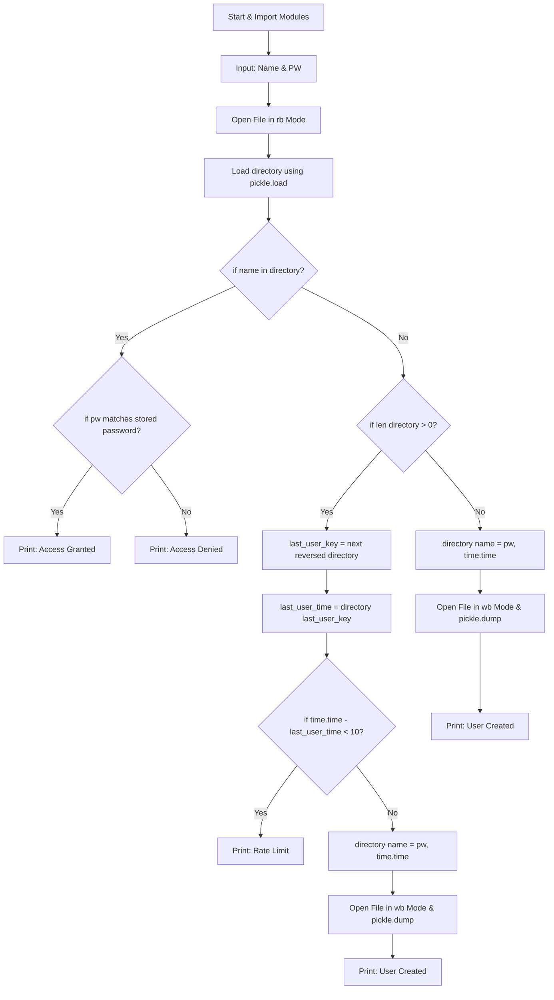

```mermaid
graph TD
    A[Start & Import Modules] --> B[Input: Name & PW]
    B --> C[Open File in rb Mode]
    C --> D[Load directory using pickle.load]
    
    D --> E{if name in directory?}
    
    %% Username matches (Authentication)
    E -- Yes --> F{if pw matches stored password?}
    F -- Yes --> G[Print: Access Granted]
    F -- No --> H[Print: Access Denied]
    
    %% New Registration Path
    E -- No --> I{if len directory > 0?}
    
    %% If DB is not empty (Check Rate Limit)
    I -- Yes --> J[last_user_key = next reversed directory]
    J --> K[last_user_time = directory last_user_key]
    K --> L{if time.time - last_user_time < 10?}
    L -- Yes --> M[Print: Rate Limit]
    L -- No --> N[directory name = pw, time.time]
    N --> O[Open File in wb Mode & pickle.dump]
    O --> P[Print: User Created]
    
    %% If DB is totally empty
    I -- No --> Q[directory name = pw, time.time]
    Q --> R[Open File in wb Mode & pickle.dump]
    R --> S[Print: User Created]
```
Flowchart for Login Page. 
Made using mermaid.js
